# Lecture 2: Stochastic Systems and AI Agents

*Alessandro Achille, September 30, 2026*

## The problem: an agent that writes a code base

Our motivating example is a coding agent asked to build a todo REST API with FastAPI, with tests. The agent answers that it will create the app and a test file, and writes `app/main.py` and `tests/test_todos.py`. We then ask it to store the todos in SQLite instead of in memory. It edits `app/main.py` and runs `pytest`, which fails on `test_delete_todo` with `405 Method Not Allowed`. The agent reads the error, notices that the DELETE route is missing, adds it, and runs the tests again, and this time all 4 pass. Then we ask for the next feature, authentication.

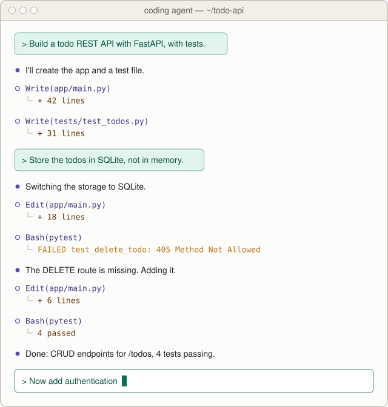

*Figure: A session with a coding agent. The human's messages are in green boxes, and the agent's replies, file writes and test runs follow each one.*

A single prompt sets off many steps. The agent writes files, runs commands and reads the errors, and every one of these steps is sampled. If we run the same prompt again, we get a different code base. Small deviations also compound, so one wrong choice early can derail the whole run.

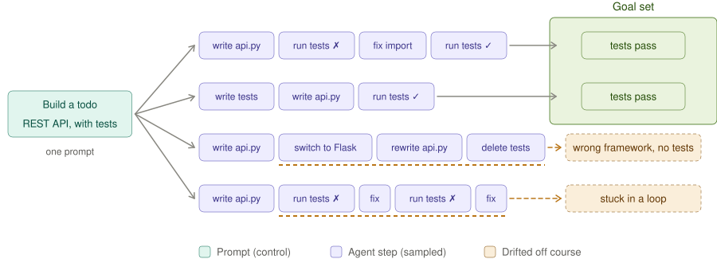

*Figure: The same prompt, run four times. Two runs end with passing tests in the goal set. One switches to Flask and deletes the tests, and one gets stuck in a loop of failing tests and fixes.*

We can picture the problem in the space of all possible code bases. The agent starts from an empty repo, and each step, such as writing code or running tests, moves it to another code base. Some trajectories end in the goal set of acceptable code bases, and others get stuck. The question of this lecture is how we steer the agent into the goal set, and what it costs to get there.

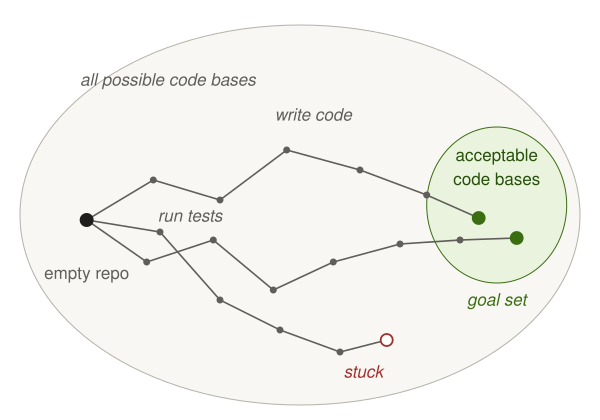

*Figure: Trajectories from an empty repo through the space of all possible code bases. Two reach the goal set of acceptable code bases, and one gets stuck.*

## Stochastic dynamical systems

A simpler system with the same flavor is a car driving on ice. At every step the driver intends to move the car one cell forward, but the car may slip. It reaches the cell ahead with probability 0.8, and it slips to the cell above or below with probability 0.1 each.

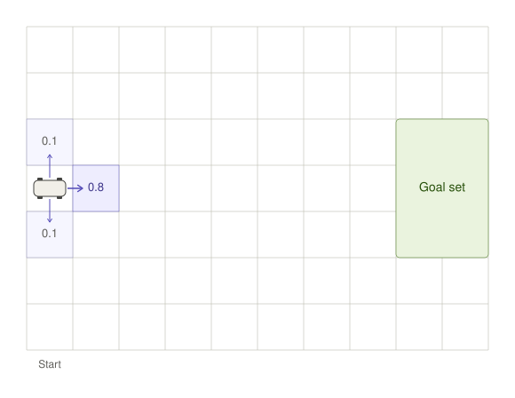

*Figure: From the start, the car moves to the cell ahead with probability 0.8 and slips up or down with probability 0.1 each. The goal set is on the right.*

Left alone, the slips accumulate and push the car off course. In the trajectory below the car slips upward twice, and the driver corrects with two control actions that steer it back down, until it reaches the goal set.

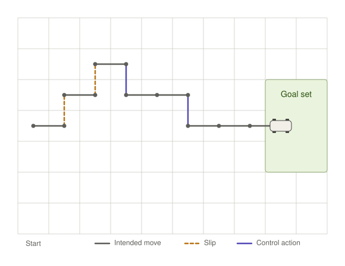

*Figure: One trajectory of the car. Gray segments are the intended moves, dashed orange segments are slips, and blue segments are the control actions that bring the car into the goal set.*

Formally, a stochastic dynamical system is defined by a state space $\mathcal{X}$, with the state $x_t \in \mathcal{X}$ at time $t$, and by a transition function

$$x_{t+1} \sim p(\cdot \mid x_t).$$

In the example, the state $x_t$ is the position and speed of the car, and the transition function $p(\cdot \mid x_t)$ is the distribution over the possible next states of the car. A trajectory is the sequence of states that the system goes through over time,

$$\tau = (x_0, x_1, \dots, x_T).$$

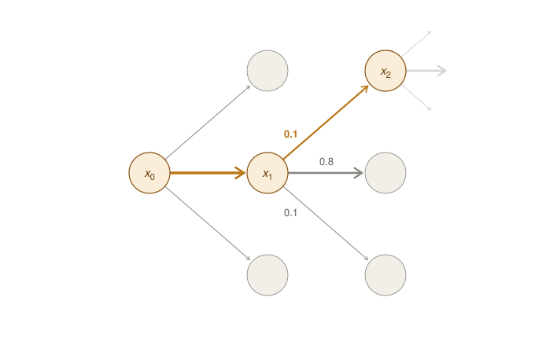

*Figure: From each state the system moves to one of three next states, with probabilities 0.8, 0.1 and 0.1. The highlighted path is one sampled trajectory, which takes a 0.1 branch at $x_1$.*

## Controlled systems and policies

A controlled stochastic dynamical system adds an action space $\mathcal{U}$ and a controlled transition

$$x_{t+1} \sim p(\cdot \mid x_t, u_t).$$

An action $u_t \in \mathcal{U}$ taken at time $t$, such as steering the car, changes the likelihood of transitioning to each next state. A policy $u_t \sim \pi(\cdot \mid x_t)$ is a function that decides the next action based on the state, and the entity that enacts the policy is called an agent. A policy can be closed-loop, in which case the action depends on the observations, or open-loop, in which case all the actions are planned ahead and executed without looking at the result.

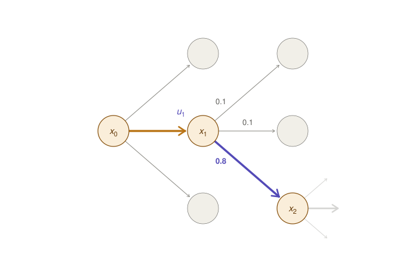

*Figure: The action $u_1$ at $x_1$ steers down-right, and the probability 0.8 moves onto that transition.*

## LLMs as stochastic dynamical systems

A large language model is an auto-regressive distribution over sequences of tokens. Given the sequence of tokens so far, $(h_1, \dots, h_t)$, which is the message history, the LLM computes the distribution of the possible next token,

$$h_{t+1} \sim p_w(h_{t+1} \mid h_1, \dots, h_t).$$

This is a particular stochastic dynamical system, and controlling it is the goal of this class. To treat it as one, we have to say what the state is, what the transition function is, and what the control actions are.

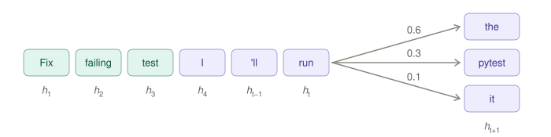

*Figure: The history “Fix failing test” is followed by the sampled tokens “I 'll run”. The next token is “the” with probability 0.6, “pytest” with 0.3 and “it” with 0.1.*

The state of the LLM is the sequence of tokens in its history, $x_t = (h_1, \dots, h_t)$. To move to the next state, we sample the next token

$$h_{t+1} \sim p_w(h_{t+1} \mid x_t)$$

and append it to the state, so that $x_{t+1} = (h_1, \dots, h_t, h_{t+1})$. The transition function is the distribution $p_w$ that the model computes.

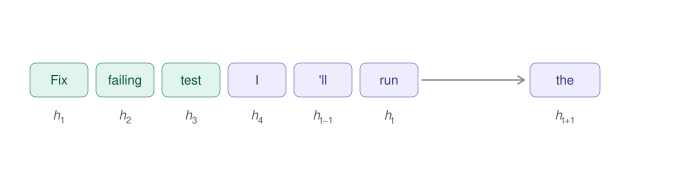

*Figure: Appending the sampled token “the” to the state $x_t$ gives the new state $x_{t+1}$.*

## Inside the state: the KV cache

Inside the model, the token history is stored as keys and values at every layer, which is called the KV cache. Each forward pass writes the keys and values of the new tokens into the cache, and the query of the newest token attends over all the cached keys. The output of the pass is a distribution over the vocabulary, not a token, and sampling from that distribution is where the stochasticity enters. The sampled token is appended to the state, and its keys and values are computed on the next pass. A controller can also inject tokens directly, as when the output of a tool is appended, and no sampling happens for those tokens. The context window is the horizon of the system: once it is full, the state can no longer grow.

The stepper below runs this loop on the prompt “Fix failing test”. The first button steps to the next phase, and its label names that phase, such as “Run forward pass” or “Compute distribution”. “Inject tool output” appends the tokens of a tool result, and the keys Space, I and R step, inject and reset as well.

<iframe src="lecture_2/kv_cache_stepper.html?theme=light" title="KV-cache state update" style="width:100%;height:700px;border:0"></iframe>

*Figure: The KV-cache state update. Teal tokens are injected by the controller, purple tokens are sampled by the model, and amber keys and values are being computed in the current pass. The next-token distributions are scripted for illustration and do not come from a real model.*

## Controlling an LLM with messages

A human controls the LLM by adding a message $u_t$ to its state, $x_{t+1} = (x_t, u_t)$. In open-loop control there is a single initial prompt $u_0$, after which the model runs on its own, so the prompt has to anticipate everything. In closed-loop control we keep prompting: we read what the agent did, and then correct it with $u_1, u_2, \dots$.

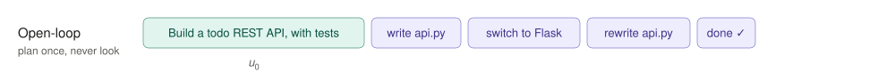

*Figure: Open-loop control. After the single prompt, the agent writes `api.py`, switches to Flask, rewrites `api.py` and declares itself done.*

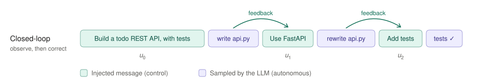

*Figure: Closed-loop control. After the agent writes `api.py`, the human asks it to use FastAPI, and after the rewrite the human asks it to add tests, which then pass.*

Closed-loop control is more robust, but it costs human attention at every step. Whether we can do better than prompting every few minutes is also a topic of this class.

## LLMs are also agents

The human is an agent that controls the LLM, and its actions are messages. But the LLM is also an agent, one that controls its environment, and its actions are tool calls, such as editing a file, running the tests or searching the web.

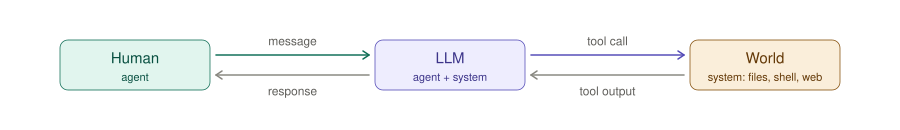

*Figure: The human sends messages to the LLM and reads its responses. The LLM, an agent together with its system, sends tool calls to the world of files, shell and web, and reads the tool outputs.*

An action $a_t$ on the environment produces a state update and an observation:

$$\mathrm{world}_{t+1} \sim p(\cdot \mid \mathrm{world}_t, a_t), \qquad o_{t+1} = g(\mathrm{world}_{t+1}).$$

We generally do not know the full state of the environment, so we have to control it based only on the observations. This is called partial observability. The world is a second source of stochasticity, and also a second source of information.

## How LLMs act: tool calling

LLMs act through tool calls. The LLM samples a tool call action $a_t \sim p_w(\cdot \mid x_t)$, for example `web_search`, and the harness executes it, so that the state of the world evolves as $\mathrm{world}_{t+1} \sim p(\cdot \mid \mathrm{world}_t, a_t)$.

The action affects the LLM's own state through the observation $o_t$ that the tool generates, which is the tool result. The harness adds the observation to the state:

$$x_{t+1} = (x_t, a_t, o_t).$$

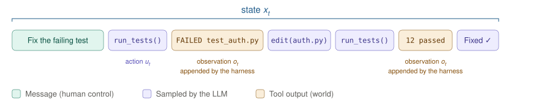

*Figure: The state after the message “Fix the failing test”. The LLM calls `run_tests()`, the harness appends the observation `FAILED test_auth.py`, the LLM edits `auth.py` and runs the tests again, and after the observation `12 passed` it reports the fix.*

## Rewards and costs

Agents act to maximize a reward $R(\tau)$, a score that the environment assigns to the agent's trajectory $\tau$. The score can be binary, pass or fail, or continuous. For an LLM agent, rewards come from human feedback or are verifiable, and they score the final state: do the tests pass, and did we build what was asked?

Every action $u_t$ that the agent takes may also incur a cost $c(x_t, u_t)$. The goal of control is to find a policy $\pi$ that maximizes reward while minimizing cost:

$$\max_\pi \; \mathbb{E}_\tau \left[ R(x_T) - \sum_t c(x_t, u_t) \right].$$

For LLMs the costs come in three kinds. The cost of computation is every token processed, and the state keeps growing. The cost of time comes from tokens being generated one at a time and from tools that take time to run. The cost of human effort is the time a human spends controlling the system, since every closed-loop message needs a human in the loop. The cost of computation is usually ignored in control theory, but it is fundamental for AI agents, and it is also a topic of this class.

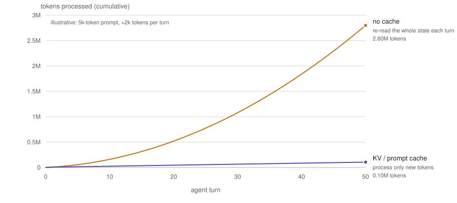

*Figure: Tokens processed over 50 agent turns, for an illustrative 5k-token prompt that grows by 2k tokens per turn. Re-reading the whole state each turn processes 2.80M tokens in total, while a KV or prompt cache, which processes only the new tokens, processes 0.10M.*

## Information

Agents need information about the task and the environment in order to act. This information comes from the weights, from memory, from the internal state, from observations, and from control inputs, that is, user messages. Information about the intent or task exists only in the human's head, and the model has to acquire it through messages. Information about the world, such as the code, the docs and the tests, enters through tool outputs and through the prior in the weights. In the end, the policy can act only on what the model has in its state.

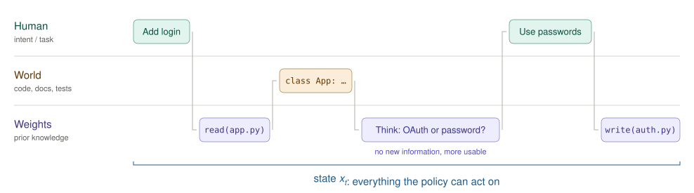

*Figure: Information enters the state from three sources. The human's messages “Add login” and “Use passwords” carry the intent, the tool output `class App: …` brings in the code, and the model's own steps, like the thought “OAuth or password?”, draw on prior knowledge in the weights. The state $x_t$ is everything the policy can act on.*

Thinking does not create information. A sampled thought $h_{t+1} \sim p_w(\cdot \mid x_t)$ adds nothing about the task that was not already in $x_t$, which is the data processing inequality. Thinking can, however, make information usable: a bounded model may be able to act on some information only after reasoning through it.[^1] Information is also not just factual but algorithmic, in the sense of the structure of a task that allows us to solve it more quickly. Acquiring information, storing it and using it is the core problem of machine learning, and the next lecture dives into it.

## Building control systems for agents

In this class we will see how to build control systems for agents, and we will use AI Functions to do it. AI Functions let us define closed-loop control systems that solve tasks. They support both soft rewards and verifiable rewards, we will see how to write formal specifications for controlling AI agents with them, and their execution is economic-aware.

[^1]: Xu et al., “A Theory of Usable Information under Computational Constraints”, ICLR 2020.
