# Lecture 3: Shannon Information and Inductive Learning

*Alessandro Achille, October 5, 2026*

## Where we left off

In the last lecture we saw that an agent needs information about the task and about its environment in order to act. That information can come from several places: the weights of the model, memories it retrieves, its internal state, the observations returned by tools, and the control inputs, which are the user's messages. Information about the intent of the task exists only in the human's head, so the model has to acquire it. Information about the world, such as the code, the docs and the tests, enters through tool outputs and through the weights. Finally, the policy can only act on what is actually present in its state.

This leaves two questions open, and they are the subject of this lecture. How do we measure information, and where does it live?

## What information to keep?

Two examples make the question concrete. The first is about activations: a coding agent reads a test log of 500k tokens, but it only has 8k tokens of context. It cannot keep everything, so what should it keep? The second is about weights: we train a network on 150 TB of data, but the weights take only 0.5 TB. Most of what was in the data cannot be in the weights, so which information do they keep?

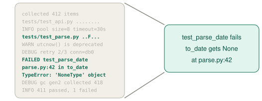

*Figure: From a long test log, only three facts matter for the fix: test_parse_date fails, to_date gets None, and the error is at parse.py:42.*

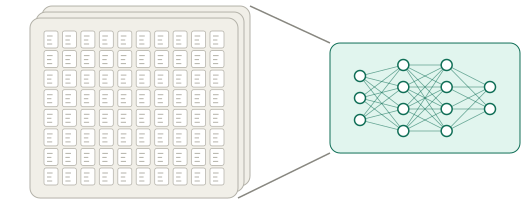

*Figure: Training squeezes a large dataset into a much smaller set of weights.*

Today's question is therefore what information a system should keep, and how much of it. A related and perhaps surprising question is whether throwing information away can improve performance.

## Entropy measures the volume of uncertainty

Before deciding what to keep, we need a way to measure information. A useful picture is a map of where an object could be. When we know its position exactly, the set of possible positions is a single point and the entropy is zero. When the position is uncertain, the set of possible positions is a large region and the entropy is high.

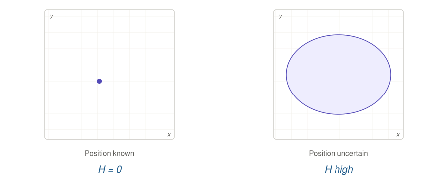

*Figure: A known position has entropy $H = 0$, while an uncertain position, spread over a large region, has high entropy.*

One bit of information, such as “it is on the left”, rules out half of the possible positions. The volume of uncertainty is cut in half, and the entropy drops by one bit.

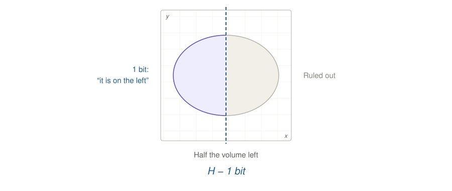

*Figure: The answer “it is on the left” rules out the right half, leaving half the volume and an entropy of $H - 1$ bit.*

## Entropy of a uniform distribution

The same idea gives an exact count for a uniform distribution. If an object is one of $N$ equally likely objects, we need $\log N$ cuts in half to single it out, so its entropy is

$$
H(p) = \log N.
$$

With $N = 8$ objects we need $\log 8 = 3$ cuts. Each cut answers one yes-or-no question, and writing down the answers gives the index of the object in binary. In the figure, the object $x_6$ sits in the right half, then in the left half of that, then in the right half again, which spells out the code 101. So $\log N$ is also the number of bits needed to encode the index of the object.

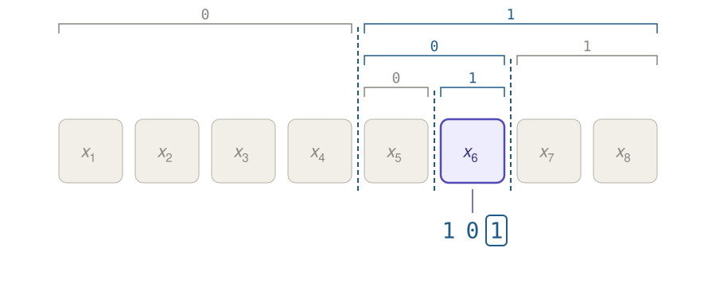

*Figure: Three cuts in half single out $x_6$ among eight objects, and the three answers form its code 101.*

## Shannon entropy and optimal codes

When the distribution is not uniform, the entropy is defined as

$$
H(X) = -\sum_i p(x_i) \log p(x_i).
$$

Shannon's coding theorem explains why this is the right quantity.[^shannon] If we want to transmit samples of $X$ without loss, no code can use fewer than $H(X)$ bits per symbol on average, and a code that gives each $x$ a codeword of $-\log p(x)$ bits gets within one bit of this limit. In other words, the negative log-likelihood $-\log p(x)$ of a sample is the length of its optimal code.

As an example, consider how to compress the string “ha ha ha ha, very very funny joke”. It has eight words: “ha” appears with probability 1/2, “very” with probability 1/4, and “funny” and “joke” with probability 1/8 each. The optimal code gives each word a codeword of $-\log_2 p(x)$ bits: one bit for “ha”, two bits for “very” and three bits each for “funny” and “joke”. The codewords come from cutting the probability mass in half repeatedly, just as we did for the uniform case.

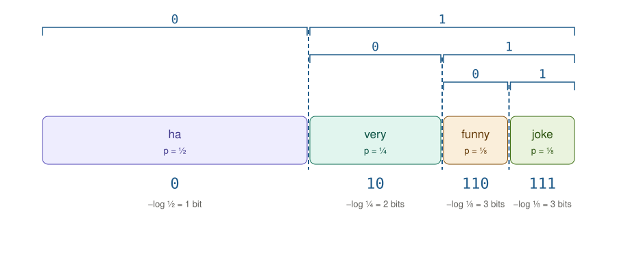

*Figure: Repeated cuts of the probability mass give the codewords 0 for “ha”, 10 for “very”, 110 for “funny” and 111 for “joke”.*

The whole string then takes $4 \cdot 1 + 2 \cdot 2 + 3 + 3 = 14$ bits. This is 8 words times 1.75 bits, and 1.75 bits is exactly the entropy $H(X)$ of the word distribution. A code that uses the same length for every word would need 2 bits per word, or 16 bits in total.

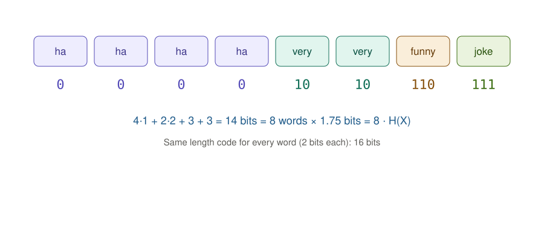

*Figure: The encoded string takes 14 bits, which is $8 \cdot H(X)$, while a fixed-length code would take 16 bits.*

This is how gzip works, and how the BPE encoding used by tokenizers works.

## Learning is compression

In practice we do not know the distribution $p(x)$ of the data, but we have samples from it. We can then train a distribution $p_w(x)$ to minimize the negative log-likelihood of the data:

$$
L = -\sum_{x \in D} p(x) \log p_w(x) = H_{p_w}(X).
$$

This is the cross-entropy loss, and it is the loss used to train LLMs. A theorem tells us what minimizing it achieves: the minimum of the cross-entropy loss is $H(X)$, and it is reached exactly when $p_w(x) = p(x)$. Since $-\log p_w(x)$ is the length of the code for $x$ under $p_w$, learning the data distribution is equivalent to learning the best compression of the data.

## Mutual information

Entropy measures the information in one variable. To measure how much one variable tells us about another, we first define the conditional entropy

$$
H(X \mid Y) = H(X, Y) - H(Y),
$$

which answers the question of how much more information $X$ and $Y$ have together than $Y$ alone. The mutual information is then

$$
I(X; Y) = H(X) - H(X \mid Y),
$$

and it measures how much knowing $Y$ reduces the uncertainty about $X$. In the compression view, it is the number of bits we save when encoding $X$ if we already know $Y$.

## Measuring information with an LLM

Since an LLM is a distribution over text, we can use it to measure information directly. Which of two sentences has the higher entropy, “The cat sat on the mat.” or “Purple silent rocks dream loudly.”? To answer, we need $\log p(x)$, where $x = (x_1, \dots, x_n)$ are the tokens of the sentence. By the chain rule,

$$
\log p(x) = \log p(x_1) + \log p(x_2 \mid x_1) + \log p(x_3 \mid x_1, x_2) + \dots,
$$

and every term of this sum is exactly what an LLM outputs. The numbers in this section were computed with a local base model rather than a chat model, since what we want is $p(x)$ itself. The familiar sentence costs 26 bits, while the unusual one costs 86 bits.

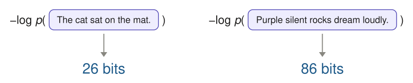

*Figure: Under the LLM, “The cat sat on the mat.” costs 26 bits and “Purple silent rocks dream loudly.” costs 86 bits.*

The same tool measures mutual information. For a single pair of sentences, the pointwise mutual information is

$$
\mathrm{PMI}(x, y) = -\log p(x) + \log p(x \mid y),
$$

which is the number of bits saved on $x$ once $y$ is known. Our example is $x$ = “She speaks French fluently.”, which costs 35 bits on its own. Given “Alice grew up in Paris.” it costs only 21 bits, so the two sentences share 14 bits. Given “The stock market fell today.” it costs 32 bits, so they share only 3 bits.

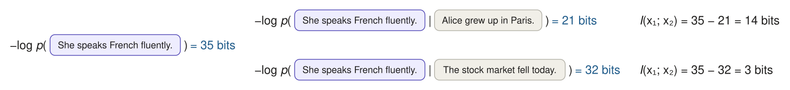

*Figure: “She speaks French fluently.” costs 35 bits alone, 21 bits after “Alice grew up in Paris.” and 32 bits after “The stock market fell today.”, for a mutual information of 14 and 3 bits.*

## The data processing inequality

We return to the coding agent and its test log. Here $X$ is the log, $Y$ is the correct fix, and $f(X)$ are the notes the agent writes from the log. The notes only see the fix through the log, so they cannot know more about the fix than the log itself does. This is the data processing inequality:

$$
I(f(X); Y) \le I(X; Y).
$$

In short, torturing the data cannot create information.

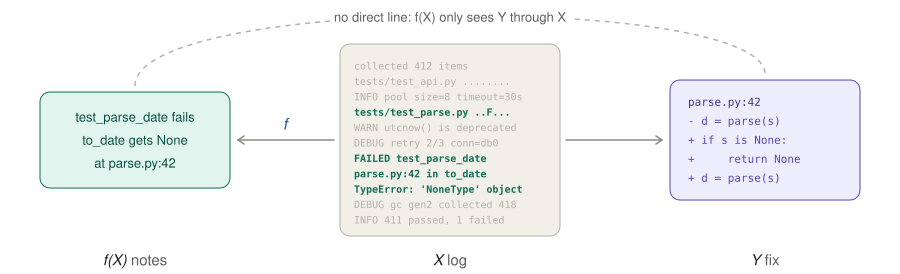

*Figure: The notes $f(X)$ are computed from the log $X$, so they only see the fix $Y$ through the log.*

This raises an open problem. If processing cannot create information, why does computation help us extract information? We do not have a good definition of accessible information, and such a definition might even bear on the question of whether P = NP.

## Communication, not meaning

Which of several cuts of a distribution is the most informative? In the figures below, the distribution $p(X)$ is made of two round clusters of equal mass. We can cut it in half in many ways: we can say which cluster a point is in, whether it lies in the top or the bottom half, or which side of a random, irregular boundary it falls on. Because the distribution is symmetric, every one of these cuts splits the mass in half, so every one of them provides exactly one bit of information.

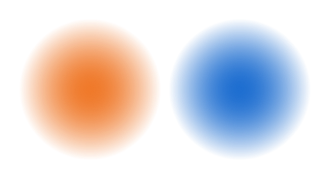

*Figure: A cut that tells us which cluster the point belongs to provides one bit.*

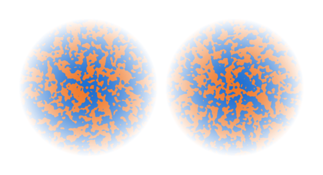

*Figure: A random, irregular cut of the same distribution also provides one bit.*

Yet it does not feel like a random cut is “informative” in the same way as knowing which cluster a point belongs to. Shannon information is about communication, not about meaning. What semantic information is remains an open problem.

## Does noise have information?

The same issue shows up with images. In our example the signal $X$ is a five-color version of Mondrian's “Composition II in Red, Blue, and Yellow”, noise $N$ is added to every pixel, and the result is $Y$. How much mutual information do $X$ and $N$ each have with $Y$?

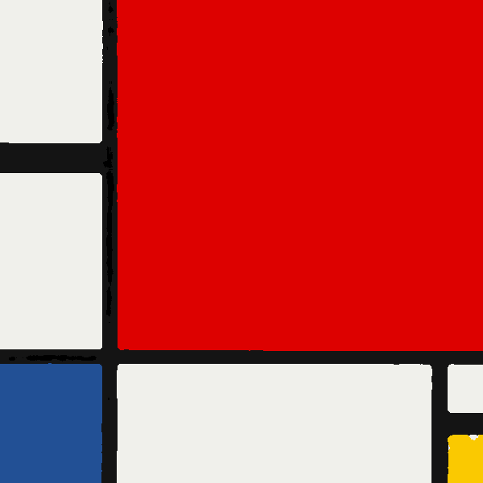 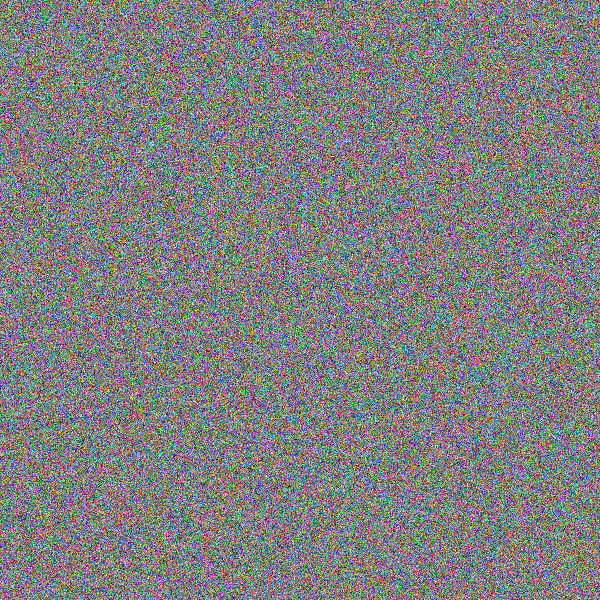 

*Figure: The signal $X$, the noise $N$ and their sum $Y$.*

Estimating the mutual information by compressing the images with a lossless codec gives $I(X; Y) = 1.2$ Kb, while the noise shares about 4,244 Kb with $Y$. The signal has few bits and the noise has many, so for Shannon's information the noise is the most informative part of the image.

## The information bottleneck

A task gives us a way to decide what is meaningful: the semantic information is the information we need for the task. For the coding agent, the question becomes which information to extract from the error logs so as to reduce as much as possible the uncertainty about the correct fix. Here $X$ is the log, $Z$ is what we extract from it, and $T$ is the task. The information bottleneck Lagrangian is

$$
L = H(T \mid Z) + \beta I(Z; X).
$$

The first term is the uncertainty that remains about the task, and the second is the information that $Z$ keeps about the input. Minimizing $L$ asks for a representation that reduces the uncertainty on the task while using as little information as possible. This view is also known as rate distortion.

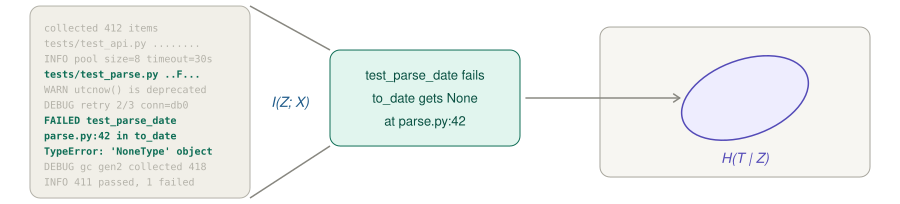

*Figure: The notes $Z$ keep $I(Z; X)$ bits of the log, and leave an uncertainty $H(T \mid Z)$ about the task.*

We can ask the same question about training: what information should we store in the weights? With $D$ the dataset and $W$ the weights, the Lagrangian becomes

$$
L = H_{p_w}(Y \mid W) + \beta I(W; D),
$$

where the first term is the prediction error and the second is the information stored in the weights.

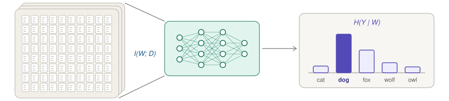

*Figure: The weights store $I(W; D)$ bits of the dataset, and their predictions leave an uncertainty $H(Y \mid W)$ about the label.*

This raises a natural question. Why do we not simply scale up the model to remove the bottleneck?

## Inductive learning and information

Before training, many classifiers are compatible with what we know. Each sample rules some of them out, so the dataset carries information about the weights, $I(W; D)$. More data leaves fewer compatible classifiers, and so a lower entropy $H(W \mid D)$. Learning is cutting down the space of hypotheses, the same picture as the cut of the volume of uncertainty at the start of the lecture.

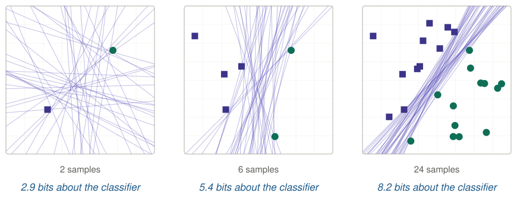

*Figure: The linear classifiers that remain compatible with 2, 6 and 24 samples, which give 2.9, 5.4 and 8.2 bits about the classifier.*

The bit counts in the figure come from a uniform prior over lines, given by a direction and an offset. The fraction of lines that are still consistent with the samples is estimated by sampling, and the information is $-\log_2$ of that fraction.

## Compression implies generalization

Storing information in the weights has a risk. With $N$ labeled samples, $N$ bits of weights are enough to store every label. Such a model has zero training error, but it has learned nothing about new samples.

Information theory makes this precise. A theorem of Xu and Raginsky[^xu] states that, for a $\sigma$-subgaussian loss,

$$
\left| \mathbb{E}[L_{\mathrm{test}} - L_{\mathrm{train}}] \right| \le \sqrt{\frac{2 \sigma^2 I(W; D)}{N}}.
$$

If the weights store far fewer bits than the number of samples, the test error is close to the training error. The bound is sufficient, not necessary, and it tells us that compression implies generalization.

How do we compress the weights, then? Using fewer weights would make the model less expressive. But bits are not parameters: what matters is how precisely the weights must be specified, not how many there are.

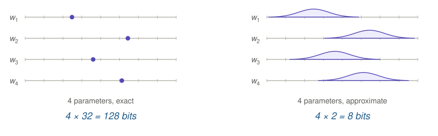

*Figure: Four parameters stored exactly take $4 \times 32 = 128$ bits, while the same four parameters specified only approximately take $4 \times 2 = 8$ bits.*

## SGD noise limits information

What limits the information in the weights of a deep network? The noise of SGD. Each step uses a random minibatch, so the gradient is noisy, and the weights can only keep details that survive the noise.

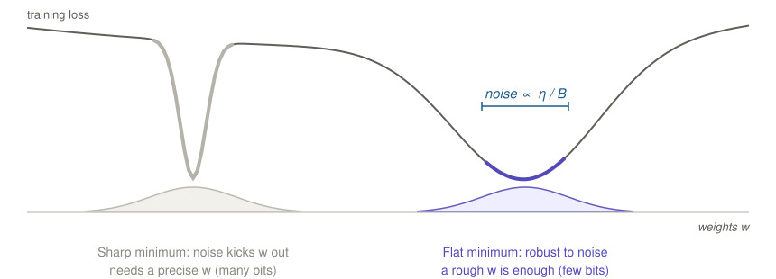

*Figure: At a sharp minimum the noise kicks $w$ out, so the minimum needs a precise $w$ and many bits. A flat minimum is robust to noise, and a rough $w$ is enough.*

The scale of the noise is proportional to $\eta / B$, the learning rate divided by the batch size. Scaling the learning rate and the batch size together gives similar generalization,[^goyal][^smith] and less noise, as with a large batch, leads to sharper minima and worse generalization.[^keskar]

## Deep networks can memorize

There is a problem with this story. The same network that generalizes on real labels can also fit random labels perfectly.[^zhang] It has room to store everything, and it generalizes anyway.

Why this works is mostly an open problem. There are several candidate explanations:

- Flat minima and PAC-Bayes: the solutions found by SGD are robust to noise in the weights, so they are cheap to describe.[^hochreiter][^dziugaite]
- Implicit bias: gradient descent prefers simple solutions, for example the max-margin one.[^soudry]
- Simplicity bias: most parameters map to simple functions.[^valle]
- Benign overfitting: interpolating noise can be harmless in high dimension.[^belkin][^bartlett]

The capacity of a network says what it can store, while what it does store depends on the training.

## Minimal representations are invariant

So far we have talked about the information in the weights. What about the state $Z$, the representation computed from the input? Surely a larger state is better?

A representation $Z$ is sufficient if it keeps everything about the task, $I(Z; T) = I(X; T)$. It is minimal if, among the sufficient representations, it has the smallest $I(Z; X)$. A theorem of Achille and Soatto[^achille] states that for any nuisance $N$, meaning any variable that has no information about the task,

$$
I(Z; N) \le I(Z; X) - I(X; T).
$$

So a minimal sufficient representation is invariant to nuisances. If it were not, it would carry useless information, and it would not be minimal.

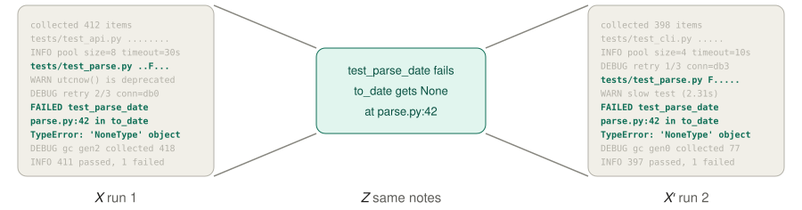

*Figure: Two runs produce different logs $X$ and $X'$, and minimal notes $Z$ are the same for both.*

Invariance to nuisances is what lets a representation transfer to new inputs, so compressing the state is good too. But we cannot just make the state smaller, since fewer dimensions make it less expressive. Here again, bits are not dimensions.

## Invariance emerges from SGD

The two halves of the story connect. SGD noise limits the information in the weights. Weights that are stable to noise compute activations that are stable to noise, so the activations cannot carry much information about the input. Invariance can therefore emerge from training with SGD, without being built into the architecture, as shown in the same work by Achille and Soatto.

As an example, why does a model learn to be invariant to the rewording of a sentence? The exact wording does not help to predict, and the weights cannot afford to store it.

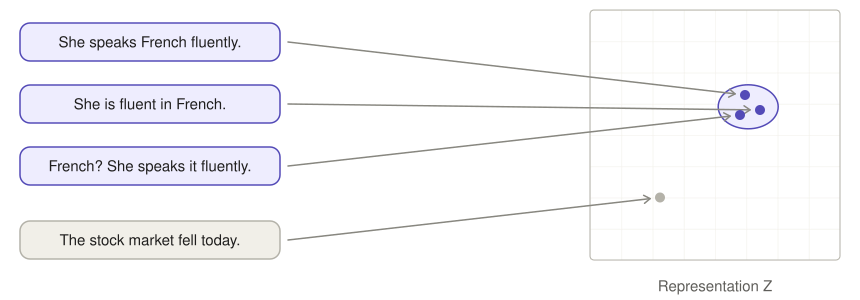

*Figure: “She speaks French fluently.”, “She is fluent in French.” and “French? She speaks it fluently.” map to nearby points in the representation $Z$, while “The stock market fell today.” maps elsewhere.*

## Semantic information

Defining semantic information is still an open problem. The information relevant to a task is semantic, but it should be possible to define semantic information without talking about a task. There is also a deeper question: why are we so fixated on distributions? Shannon's definition needs $p(x)$, but why can a single string not have information on its own?

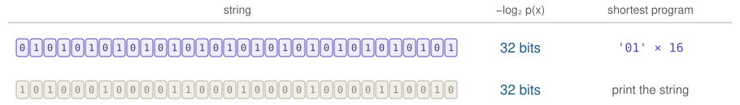

*Figure: Both strings cost 32 bits under a uniform distribution, but the first is described by the short program '01' × 16, while for the second the shortest program is to print the string.*

Under a uniform distribution both strings in the figure cost 32 bits, yet one has a short description, '01' repeated 16 times, and the other has no description shorter than itself. We will come back to this with algorithmic information, Kolmogorov complexity and the Kolmogorov structure function.

## Next time: active information

The game of twenty questions shows what is at stake. If we are handed random bits of information, it takes forever to find the answer. If we can pick the next question, each answer halves what is left, and twenty questions single out one of $2^{20} \approx 1$ million objects.

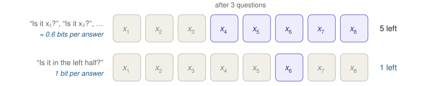

*Figure: After three questions, asking “Is it $x_1$?”, “Is it $x_2$?” and so on gives about 0.6 bits per answer and leaves 5 candidates, while asking “Is it in the left half?” gives 1 bit per answer and leaves 1.*

This is what agents need to do: choose actions, such as tool calls or questions to the user, that maximize information about the task. Two problems stand in the way. The first is observability: can any action reveal what we need? The second is identifiability: do different answers lead to different observations?

[^shannon]: Shannon, 1948.

[^xu]: Xu and Raginsky, 2017.

[^goyal]: Goyal et al., 2017.

[^smith]: Smith and Le, 2018.

[^keskar]: Keskar et al., 2017.

[^zhang]: Zhang et al., 2017.

[^hochreiter]: Hochreiter and Schmidhuber, 1997.

[^dziugaite]: Dziugaite and Roy, 2017.

[^soudry]: Soudry et al., 2018.

[^valle]: Valle-Pérez et al., 2019.

[^belkin]: Belkin et al., 2019.

[^bartlett]: Bartlett et al., 2020.

[^achille]: Achille and Soatto, 2018.
